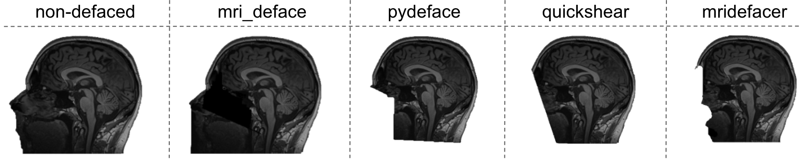

===============================
BIDSonym
===============================

.. image:: https://img.shields.io/github/issues-pr/PeerHerholz/BIDSonym.svg
    :alt: PRs
    :target: https://github.com/PeerHerholz/BIDSonym/pulls/

.. image:: https://img.shields.io/github/contributors/PeerHerholz/BIDSonym.svg
    :alt: Contributors
    :target: https://GitHub.com/PeerHerholz/BIDSonym/graphs/contributors/

.. image:: https://github-basic-badges.herokuapp.com/commits/PeerHerholz/BIDSonym.svg
    :alt: Commits
    :target: https://github.com/PeerHerholz/BIDSonym/commits/master

.. image:: http://hits.dwyl.io/PeerHerholz/BIDSonym.svg
    :alt: Hits
    :target: http://hits.dwyl.io/PeerHerholz/BIDSonym

.. image:: https://img.shields.io/badge/License-BSD%203--Clause-blue.svg
    :alt: License
    :target: https://opensource.org/licenses/BSD-3-Clause

Description
===========
A BIDS app for de-identification of neuroimaging data. Takes BIDS-format T1 and T2-weighted images and applies one of several popular de-identification algorithms. BIDSonym currently supports:
|`Pydeface <https://github.com/poldracklab/pydeface>`_
|`MRI deface <https://surfer.nmr.mgh.harvard.edu/fswiki/mri_deface>`_
|`Quickshear <https://github.com/nipy/quickshear>`_
|`mridefacer <https://github.com/mih/mridefacer>`_

**Using BIDSonym ensures that you can make collected neuroimaging data available for others without violating subjects' privacy or anonymity (depending on the regulations of the country you're in).**

Usage
=====
This App has the following command line arguments:

usage: run.py [-h]
	      [--participant_label PARTICIPANT_LABEL [PARTICIPANT_LABEL ...]]
	      [--deid {pydeface,mri_deface,quickshear}]
	      [--del_nodeface {del,no_del}]
	[--del_meta META_DATA_FIELD [META_DATA_FIELD ...]]
	      bids_dir {participant,group}

a BIDS app for de-identification of neuroimaging data

positional arguments:
  bids_dir              The directory with the input dataset formatted
			according to the BIDS standard.
  output_dir            The directory where the not de-identified raw files should be stored,
				    in case you decide to keep them.
  {participant,group}   Level of the analysis that will be performed. Multiple
			participant level analyses can be run independently
			(in parallel) using the same output_dir.

optional arguments:
  -h, --help            show this help message and exit
  --participant_label PARTICIPANT_LABEL [PARTICIPANT_LABEL ...]
			The label(s) of the participant(s) that should be
			analyzed. The label corresponds to
			sub-<participant_label> from the BIDS spec (so it does
			not include "sub-"). If this parameter is not provided
			all subjects should be analyzed. Multiple participants
			can be specified with a space separated list.
  --deid {pydeface,mri_deface,quickshear}
			Approach to use for de-identifictation.
  --del_nodeface {del,no_del}
			Overwrite and delete original data or copy original
			data to different folder.
--del_meta META_DATA_FIELD [META_DATA_FIELD ...]
		  Indicate if and which information from the .json meta-data
		  files should be deleted. If so, the original .josn files
		  will be copied to sourcedata/ .

To run it in participant level mode (for one participant):

docker run -i --rm \
	-v /Users/peer/ds005:/bids_dataset \
	bids/bidsonym \
	/bids_dataset \
participant --deid pydeface --del_nodeface no_del --del_meta 'InstitutionAddress' \
--participant_label 01

After doing this for all subjects (potentially in parallel), the group level analysis
can be run:

docker run -i --rm \
	-v /Users/peer/ds005:/bids_dataset \
	bids/bidsonym \
	/bids_dataset  group --deid pydeface --del_nodeface no_del --del_meta 'InstitutionAddress'

Documentation
=============
A documentation is currently in the works and will be available soon. Sorry for any inconvenience this might cause.

How to report errors
====================
Running into any bugs :beetle:? Check out the `open issues <https://github.com/PeerHerholz/BIDSonym/issues>`_ to see if we're already working on it. If not, open up a new issue and we will check it out when we can!

How to contribute
=================
Thank you for considering contributing to our project! Before getting involved, please review our `Code of Conduct <https://github.com/PeerHerholz/BIDSonym/blob/master/CODE_OF_CONDUCT.rst>`_. Next, you can review `open issues <https://github.com/PeerHerholz/BIDSonym/issues>`_ that we are looking for help with. If you submit a new pull request please be as detailed as possible in your comments. Please also have a look at our `contribution guidelines <https://github.com/PeerHerholz/BIDSonym/blob/master/CONTRIBUTING.rst>`_.

Acknowledgements
================
If you intend to or already used BIDSonym, we would be very happy if you cite this github repo, till we have "something" out there!
