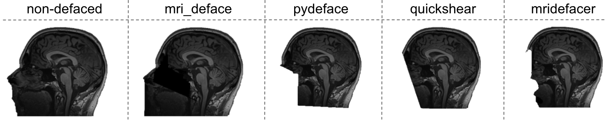

## Statement of Need
Due to the evolution of research incentives, technicaladvancements  and  the  development  of  new  standards [@eickhoff_sharing_2016; @gorgolewski_brain_2016; @nichols_best_2017; @poldrack_toward_2013; @poldrack_making_2014; @poldrack_openfmri_2017],  increasingly greater amounts of neuroimaging  data  are  being  shared  either  publicly  or made  available  through  data  user  agreements.   These datasets originate from small samples of participants collected  by  individual  research  groups,  as  well  as  from “Big Data” samples including thousands of participants collected by large research consortia (UK Biobank [@sudlow_uk_2015],  HCP [@van_essen_wu-minn_2013],  ABIDE [@di_martino_autism_2014],  ADNI  [@mueller_alzheimers_2005], etc.).   While  data  sharing  is  important  and  beneficial [@eickhoff_sharing_2016; @nichols_best_2017, @poldrack_making_2014, @poline_data_2012],  privacy  of  par-ticipant  data  must  be  protected [@bannier_open_2020; @brakewood_ethics_2013].  To that end, Ethic Re-view  Boards  and  data  sharing  platforms  typically  require that uploaded datasets are provided in anonymized or  pseudo-anonymized  form,  limiting  participant  reidentification.    However,  the  (pseudo-) anonymization process  is  deceptively  complex;  attempts  at  ensuring data  privacy  must  take  into  consideration  all  dataset components, including imaging modalities, as well as national legal and ethical frameworks.  Several algorithms have  been  developed  to  (pseudo-) anonymise  imaging datasets but they offer limited solutions.  Some are attached to specific software, some are limited to specific computing environments; most miss an in-depth assessment  and  treatment  of  the  metadata  attached  to  the dataset, or lack the capacity to automatize (pseudo-) anonymization across large datasets. BIDSonym was created to address these points in one simple, flexible, and general tool that offers users an array of automated (pseudo-)anonymization options to augment participant privacy in neuroimaging datasets.
There are two components of neuroimaging datasets that arguably pose the largest risk to maintaining participant privacy: the structural images and accompanying metadata (e.g. metadata text files or information embedded in image file headers). Structural images contain
visible identifiable participant information via facial features like the eyes, nose, and mouth, and privacy is usually addressed through a process called “defacing” within which all or a subset of these features are removed from the final structural data files. The metadata text files may
additionally contain identifiable participant data through the recording of acquisition time and location, and personal details such as date of birth, height, and weight. Here, privacy is maintained by removing or blurring this information from the final dataset. BIDSonym addresses
both vulnerabilities in neuroimaging datasets, obviating the need for multiple steps within a data sharing pipeline to ensure participant privacy.

## Summary
In concordance with the BIDS-App template [@gorgolewski_bids_2017], BIDSonym operates as a command line tool written in Python [@rossum_python_1995] and
is intended to run in its containerized version (either using Docker ([https://www.docker.com](https://www.docker.com)) or Singularity ([https://sylabs.io](https://sylabs.io)), providing all necessary software dependencies. However, it is also available as a Python package via pypi ([https://pypi.org](https://pypi.org)) to facilitate reuse in a development environment. BIDSonym expects BIDS datasets [@gorgolewski_brain_2016] and provides three core functionalities as depicted in \autoref{fig:overview}: defacing of structural (i.e. T1 and T2 weighted images, adaptation of potentially sensitive metadata information, and evaluation of (pseudo-) anonymization results.

Focusing on the first aspect, BIDSonym supports a multitude of commonly used defacing algorithms and tools, including pydeface [@gulban_pydeface_2019], mri_deface [@bischoff-grethe_technique_2007], quickshear [@schimke_quickshear_2011], and mridefacer [@hanke_mridefacer_2018]. Based on the chosen tool, facial features of the structural images of either specified participants or the whole data set are then removed. \autoref{fig:example} provides an example for the different algorithms and tools available for defacing a structural T1 weighted image. Furthermore, structural images from other modalities (e.g. T2 weighted) can also be defaced in which case the defaced T1 weighted structural image will be utilized as a deface mask. In order to account for possible errors during the defacing process, BIDSonym moves the non-defaced original structural images into a distinct directory before defacing, allowing users to test multiple defacing settings and/or options. Following BIDS [@gorgolewski_brain_2016], those files are moved to a different directory (‘/sourcedata’) and a description identifier (‘*_descnondeid*’) is added to the filenames. 

A comparable behavior is implemented with regard to metadata information in BIDSonym’s second core functionality. The information in the metadata files that accompany neuroimaging data and in the headers of neuroimaging data files will be gathered and listed within a tabular file (‘*.tsv’). If specified, the extracted information will then be queried for potentially sensitive information (e.g. name, date or place of birth, etc.) and marked accordingly. Additionally, users can specify that certain information should be deleted from metadata files, in which case they will be moved and renamed as described for the neuroimaging data.

BIDSonym’s third core functionality implements quality control assessments of the defacing results and of the information present in the data. Concerning
the first, this includes (interactive) plots that allow to evaluate if the applied algorithm and settings were too stringent (e.g. removing voxels belonging to the brain). Regarding the second, information present in the meta-data files and image headers are gathered in tabular format within respective files (‘*.tsv’). Each table contains all key-value pairs present in a given file and aims to provide an assessment of potentially sensitive
information.

More information on BIDSonym’s workflow, the corresponding processing steps and outcomes, as well as installation instructions can be found in the respective documentation ([https://peerherholz.github.io/BIDSonym](https://peerherholz.github.io/BIDSonym)) and GitHub repository ([https://github.com/PeerHerholz/BIDSonym](https://github.com/PeerHerholz/BIDSonym)).
BIDSonym provides a straightforward and flexible way to pseudo-anonymize neuroimaging datasets by a variety of means, operating on both small and large datasets through its implementation following the BIDS-App template [@gorgolewski_bids_2017]. BIDSonym depends on the nibabel [@brett_nibabel_2020], nipype [@gorgolewski_nipype_2011], nilearn [@abraham_machine_2014], pybids [@yarkoni_pybids_2019] and pandas [@mckinney_data_2010] python packages (all are well maintained and tested) and is licensed under the BSD-3 license ([https://opensource.org/licenses/BSD-3-Clause](https://opensource.org/licenses/BSD-3-Clause)). As data sharing becomes more widely adopted, BIDSonym fills an important gap for the neuroimaging community.

# Acknowledgements

P.H. and J.B.P. were supported in parts by funding from the Canada First Research Excellence Fund, awarded to McGill University for the Healthy Brains for
Healthy Lives initiative, the National Institutes of Health (NIH) NIH-NIBIB P41 EB019936 (ReproNim), as well as the National Institute Of Mental Health of the NIH under Award Number R01MH096906. P.H. was additionally supported by research scholar award from Brain Canada, in partnership with Health Canada, for the Canadian Open Neuroscience Platform initiative. This project originated as part of Neurohackademy which is funded by the National Institute of Mental Health through a grant to Ariel Rokem and Tal Yarkoni (R25MH112480). Finally, all the contributors listed in the project’s Zenodo and GitHub repository have contributed code and intellectual labor to further improve BIDSonym. The same holds true for users that reported issues and continue to
do so.

# References
